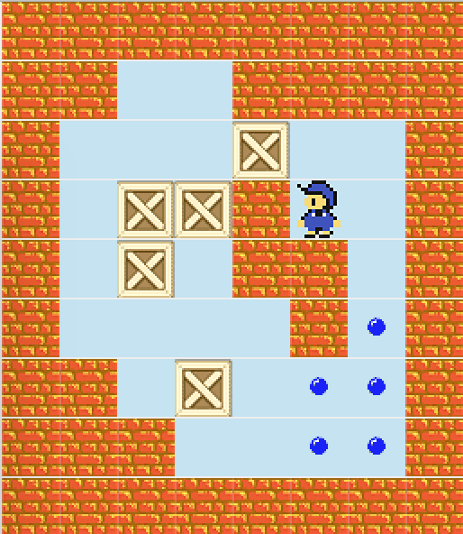

# Sokoban Solver

A program that solves the game of Sokoban with different search strategies and a visual representation of the solution.

### How to run

- `ant`
- `java -jar SokobanSolver.jar $BOARD_FILE_NAME $STRATEGY [visual]`
    - Eg. `java -jar SokobanSolver.jar board4.txt BFS visual`

### Search strategies
The available strategies are the following:
- BFS (Breadth first search)
- DFS (Depth first search)
- IDDFS (Iterative deepening depth-first search)
- ASTAR (A* search algorithm)
- GREEDY

Both ASTAR and GREEDY strategies use a default heuristic which calculates the cost as the Manhattan distance of the player to the closest box plus the Manhattan distance of each box to its closest goal.
If you want to use one of the other 3 implemented heuristics or implement your own check out SokobanProblem.java


### Build your own board
The format of the board file is as follows:
- Width
- Height
- Board

Where the board is a matrix of numbers where the values represent the following:
- 0	-> EMPTY
- 1 -> WALL
- 2	-> BOX
- 4	-> GOAL
- 6	-> BOX ON TOP OF GOAL
- 8	-> PLAYER
- 12    -> PLAYER ON TOP OF GOAL

Example of board file:
```
9
8
1 1 1 1 1 1 1 1
1 1 0 0 1 1 1 1
1 0 0 0 2 0 0 1
1 0 2 2 1 8 0 1
1 0 2 0 1 1 0 1
1 0 0 0 0 1 4 1
1 1 0 2 0 4 4 1
1 1 1 0 0 4 4 1
1 1 1 1 1 1 1 1
```


Would represent the following board state



